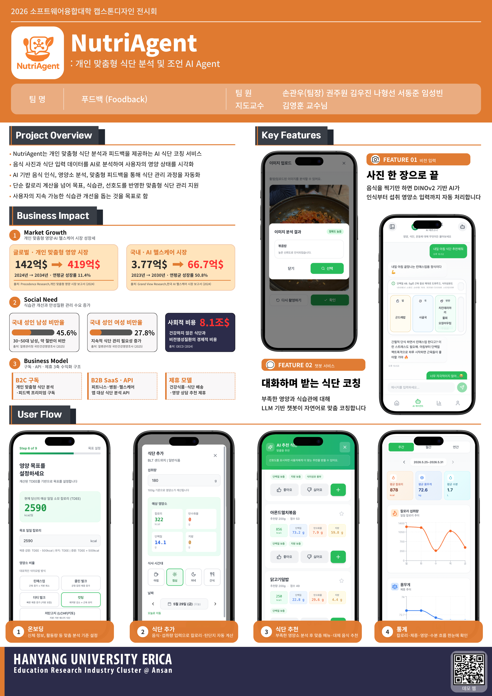
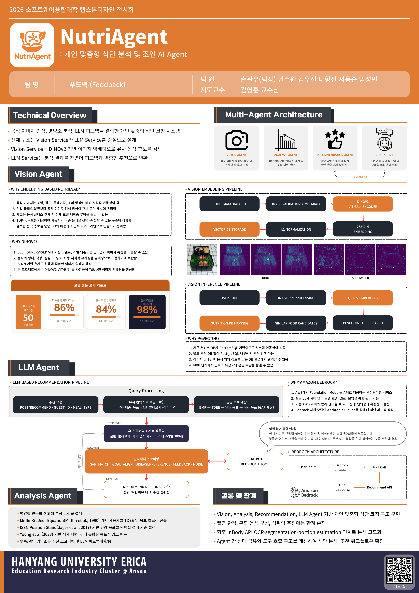

# NutriAgent

> 개인 맞춤형 식단 분석 및 조언 AI Agent

NutriAgent는 사용자의 식단 기록과 개인 목표를 기반으로 영양 상태를 분석하고, 부족하거나 과잉된 영양소에 대해 맞춤형 피드백과 식단 추천을 제공하는 AI 기반 식단 코칭 서비스입니다.

음식 사진 입력, 영양소 분석, AI 챗봇 피드백, 맞춤형 추천 기능을 통해 사용자가 자신의 식단을 더 쉽게 기록하고 관리할 수 있도록 돕는 것을 목표로 합니다.

---

## 주요 기능

### 1. 식단 기록

사용자는 음식명 검색 또는 음식 사진 업로드를 통해 식단을 기록할 수 있습니다.

* 음식명 기반 식단 입력
* 음식 사진 기반 식단 입력
* 섭취량 입력
* 식사 시간대 기록

### 2. 음식 이미지 인식

음식 사진을 업로드하면 Vision Agent가 이미지를 분석하여 유사한 음식 후보를 제공합니다.

* DINOv2 기반 이미지 임베딩 생성
* pgvector 기반 유사 음식 검색
* Top-K 음식 후보 제공
* 사용자의 최종 선택을 통한 식단 기록 보완

### 3. 영양소 분석

기록된 식단을 바탕으로 일일 영양 섭취량을 계산하고, 사용자의 목표와 비교합니다.

* 칼로리 분석
* 탄수화물, 단백질, 지방 분석
* 나트륨, 당류 등 주요 영양소 분석
* 목표 대비 부족/과잉 여부 확인

### 4. AI 식단 코칭

LLM 기반 Chat Agent가 사용자의 식단 상태를 자연어로 설명하고, 개선 방향을 제안합니다.

* 식단 분석 결과 요약
* 부족한 영양소에 대한 피드백
* 목표 기반 식단 조언
* 대체 음식 및 추천 음식 제안

### 5. 맞춤형 식단 추천

사용자의 프로필, 식단 기록, 영양 목표를 바탕으로 개인화된 식단 추천을 제공합니다.

* 부족 영양소 보완 추천
* 식단 목표 기반 음식 추천
* 알레르기 및 선호도 고려
* 건강 상태 기반 추천 확장 가능

---

## 서비스 흐름

1. 사용자가 온보딩을 통해 기본 정보와 영양 목표를 설정합니다.
2. 음식 검색 또는 이미지 업로드로 식단을 기록합니다.
3. 기록된 식단을 바탕으로 영양소를 분석합니다.
4. AI Agent가 분석 결과를 자연어 피드백으로 제공합니다.
5. 부족한 영양소를 보완할 수 있는 음식과 식단을 추천합니다.
6. 사용자는 통계 화면에서 섭취 추이와 목표 달성 현황을 확인합니다.

---

## 시스템 구조

NutriAgent는 여러 역할의 Agent가 협력하는 구조로 설계되었습니다.

|         Agent        | 역할                                          |
| :------------------: | ------------------------------------------- |
|     Vision Agent     | 음식 이미지를 분석하고 유사 음식 후보를 검색합니다.               |
|    Analysis Agent    | 사용자의 식단 기록을 기반으로 영양소를 계산하고 목표 대비 상태를 분석합니다. |
| Recommendation Agent | 부족하거나 과잉된 영양소를 기준으로 맞춤형 음식 추천을 제공합니다.       |
|      Chat Agent      | LLM을 활용해 분석 결과와 추천 내용을 자연어 피드백으로 변환합니다.     |

---

## 기술 스택

|      구분     | 기술                                                |
| :---------: | ------------------------------------------------- |
|   Frontend  | React, TypeScript, Vite                           |
|   Backend   | Spring Boot, FastAPI, PostgreSQL                  |
| AI / Vision | DINOv2, Image Embedding, pgvector, LLM 기반 자연어 피드백 |
|    Infra    | Docker, AWS EC2, Amazon Bedrock                   |

---

## 기대 효과

NutriAgent는 단순한 식단 기록 서비스를 넘어, 사용자의 목표와 현재 식단 상태를 함께 고려하는 개인 맞춤형 식단 코칭 서비스를 지향합니다.

* 식단 기록의 편의성 향상
* 개인별 영양 목표 관리 지원
* 부족 영양소 기반 식단 개선
* AI 기반 자연어 피드백 제공
* 헬스케어 및 웰니스 서비스로 확장 가능

---

## 프로젝트 포스터

<table>
  <tr>
    <td align="center">
      
       
      <b>서비스 개요</b>
    </td>
    <td align="center">
      
       
      <b>시스템 아키텍처</b>
    </td>
  </tr>
</table>
